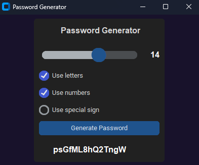

<a name="readme-top"></a>

[![Contributors][contributors-shield]][contributors-url]
[![LinkedIn][LinkedIn]][LinkedIn-url]


<!-- PROJECT LOGO -->
<br />
<div align="center">
  <a href="https://github.com/agatabiesiekierska/Password_generator">
    
  </a>

<h3 align="center">UV-VIS Spectra</h3>

  <p align="center">
    This project is a simple script for generating password and simple GUI.
    <br />
    <a href="https://github.com/agatabiesiekierska/Password_generator"><strong>Explore the docs »</strong></a>
    <br />
    <br />
    ·
    <a href="https://github.com/agatabiesiekierska/Password_generator/issues">Report Bug</a>
    ·
    <a href="https://github.com/agatabiesiekierska/Password_generator">Request Feature</a>
  </p>
</div>


<!-- TABLE OF CONTENTS -->
<details>
  <summary>Table of Contents</summary>
  <ol>
    <li>
      <a href="#about-the-project">About The Project</a>
      <ul>
        <li><a href="#built-with">Built With</a></li>
      </ul>
    </li>
    <li>
      <a href="#getting-started">Getting Started</a>
      <ul>
        <li><a href="#prerequisites">Prerequisites</a></li>
        <li><a href="#installation">Installation and Starting the program</a></li>
      </ul>
    </li>
    <li><a href="#usage">Usage</a></li>
    <li><a href="#contact">Contact</a></li>
  </ol>
</details>


<!-- ABOUT THE PROJECT -->
# About The Project

<p align="center">
    
</p>

<H4>The illustration depicts the program interface, where users can choose the length of the output password. Morover, user can choose if generated password has to have letters, numbers, and special signs. </H4>

<p align="right"><a href="#readme-top">back to top</a></p>


## Built With

[![Python][Python]][Python-url]
[![Tkinter][Tkinter]][Tkinter-url]
[![Tkinter][CustomTkinter]][CustomTkinter-url]
[![Tkinter][Pyinstaller]][Pyinstaller-url]


<p align="right"><a href="#readme-top">back to top</a></p>


<!-- GETTING STARTED -->
## Getting Started

### Download program
If you want to use this program just download file called <b>"Password_Generator_.exe"</b>. It contains all required packages in correct versions so after you launch the file everything should work.

### Manual Installation
If for some reason you don't want to use .exe version, here's the instructions what should you do:

* To use properly this program you need Python on your computer in version 3.11. You can download it after you hit this banner:  
[![Python][Python]][Python-url]

* Clone the repo (or just download folder with all files)
  ```sh
   git clone https://github.com/agatabiesiekierska/Password_generator.git
  ```

* In file <b>"requirements.txt"</b> I put all the packages I used in this project (with versions). You can use it to install all packages using command below (remember to move to directory with the file):
  
  ```sh
  pip install -r requirements.txt
  ```

* To start program just type:
   ```sh
   python GUI.py
   ```


<p align="right"><a href="#readme-top">back to top</a></p>


<!-- USAGE EXAMPLES -->
## Functions of program

Using the program is very simple: set the password length and choose which type of characters to use.


<!-- CONTRIBUTING -->
## Contributing

If you have a suggestion that would make this program better, please fork the repo and create a pull request. 

1. Fork the Project
2. Create your Feature Branch (`git checkout -b feature/NewFeature`)
3. Commit your Changes (`git commit -m 'Add some NewFeature'`)
4. Push to the Branch (`git push origin feature/NewFeature`)
5. Open a Pull Request

<p align="right"><a href="#readme-top">back to top</a></p>


<!-- CONTACT -->
## Contact

 [![LinkedIn][LinkedIn]][LinkedIn-url]  

Project Link: [https://github.com/agatabiesiekierska/UV-VIS-spectra](https://github.com/agatabiesiekierska/UV-VIS-spectra)

Gmail: ag.biesiekierska@gmail.com

<p align="right"><a href="#readme-top">back to top</a></p>


<!-- MARKDOWN LINKS & IMAGES -->
<!-- https://www.markdownguide.org/basic-syntax/#reference-style-links -->

[contributors-shield]: https://img.shields.io/github/contributors/agatabiesiekierska/UV-VIS-spectra.svg?style=for-the-badge
[contributors-url]: https://github.com/agatabiesiekierska/UV-VIS-spectra/graphs/contributors

[issues-shield]: https://img.shields.io/github/issues/agatabiesiekierska/UV-VIS-spectra.svg?style=for-the-badge
[issues-url]: https://github.com/agatabiesiekierska/UV-VIS-spectra/issues

[LinkedIn]: https://img.shields.io/badge/LinkedIn-0A66C2?style=for-the-badge&logo=linkedin&logoColor=white
[LinkedIn-url]: https://www.linkedin.com/in/agata-biesiekierska-6293a4271

[Main_Window]: images_for_readme\main_window.png

[Python]: https://img.shields.io/badge/python_3.11-3670A0?style=for-the-badge&logo=python&logoColor=ffdd54
[Python-url]: https://www.python.org/downloads

[Tkinter]: https://img.shields.io/badge/Tkinter-red?style=for-the-badge&logo=python&logoColor=white
[Tkinter-url]: https://docs.python.org/3/library/tkinter.html#module-tkinter

[CustomTkinter]: https://img.shields.io/badge/CustomTkinter-%230C55A5?style=for-the-badge&logo=python&logoColor=white
[CustomTkinter-url]: https://customtkinter.tomschimansky.com

[Pyinstaller]: https://img.shields.io/badge/Pyinstaller-white.svg?style=for-the-badge&logo=python&logoColor=%black
[Pyinstaller-url]: https://pyinstaller.org/en/stable/


